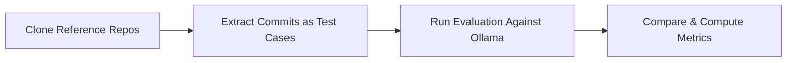
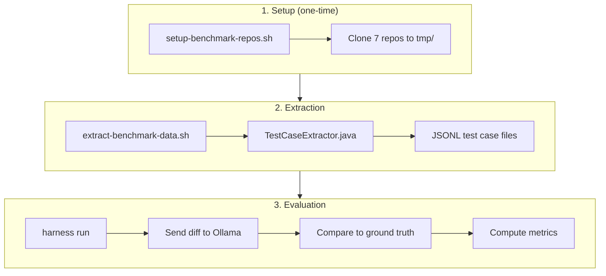
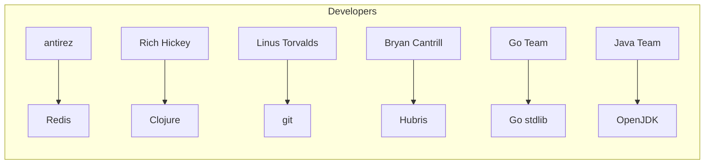
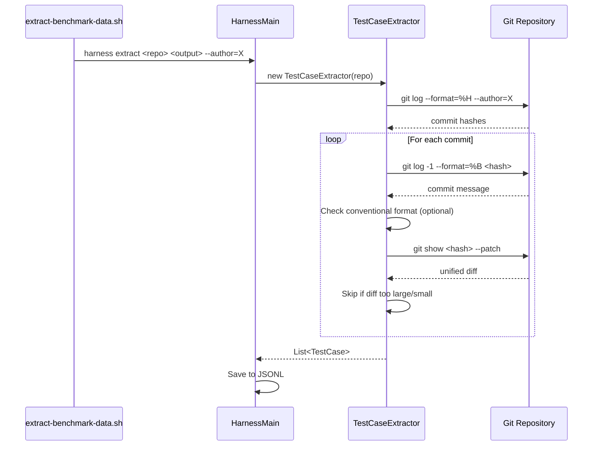

# Benchmarking Harness

This document describes the benchmarking infrastructure for evaluating joco's commit message generation quality.

## Overview

The benchmarking harness extracts real commits from reference repositories and uses them as ground truth to evaluate generated commit messages.



## Architecture



## Evaluation Dimensions

| Category | Purpose | Data Source |
|----------|---------|-------------|
| **Format Correctness** | Validate conventional commit format | Angular (100 commits) |
| **Content Quality** | Compare against expert developers | Notable developers from various projects |

### Content Quality Sources



## Usage

### Step 1: Clone Reference Repositories

```bash
./scripts/setup-benchmark-repos.sh
```

This clones 7 repositories into `tmp/` with shallow depth (500 commits each).

### Step 2: Extract Test Cases

```bash
./scripts/extract-benchmark-data.sh
```

This extracts commits into `benchmark/` directory:

```
benchmark/
├── format-correctness/
│   └── angular-commits.jsonl        # 100 conventional commits
└── content-quality/
    ├── antirez/redis-commits.jsonl  # 50 commits
    ├── rich-hickey/clojure-commits.jsonl
    ├── linus-torvalds/git-commits.jsonl
    ├── bryan-cantrill/hubris-commits.jsonl
    ├── go-team/go-commits.jsonl
    └── java-team/jdk-commits.jsonl
```

### Step 3: Run Evaluation

```bash
# Run against format correctness test cases
./mvnw exec:java -Pharness -Dexec.args="run --cases=benchmark/format-correctness/angular-commits.jsonl"

# Run against content quality test cases
./mvnw exec:java -Pharness -Dexec.args="run --cases=benchmark/content-quality/antirez/redis-commits.jsonl"

# Use a different model
./mvnw exec:java -Pharness -Dexec.args="run --cases=benchmark/format-correctness/angular-commits.jsonl --model=qwen2.5-coder:3b"
```

### Step 4: Compare Runs

```bash
./mvnw exec:java -Pharness -Dexec.args="compare <run-id-1> <run-id-2>"
```

## Test Case Format

Each JSONL file contains records with:

```json
{
  "id": "angular-a1b2c3d4",
  "diff": "unified diff content...",
  "expectedMessage": "feat(core): add new feature",
  "source": "angular",
  "commitHash": "a1b2c3d4e5f6...",
  "metadata": {
    "author": "Author Name <email@example.com>"
  }
}
```

## Extraction Process



## CLI Reference

```
harness extract <repo-path> <output.jsonl> [options]
    --max=N           Maximum commits to extract (default: 50)
    --name=NAME       Repository name (default: directory name)
    --no-filter       Accept all commits, not just conventional format
    --author=PATTERN  Filter commits by author name/email pattern

harness run [options]
    --template=ID     Prompt template ID (default: baseline-v1)
    --model=MODEL     Ollama model (default: qwen2.5-coder:1.5b)
    --max=N           Limit test cases (default: all)
    --cases=FILE      Test cases file
    --run-id=ID       Custom run ID (default: timestamp)
    --temp=T          Temperature (default: 0.7)

harness compare <run1> <run2>
    Compare metrics between two test runs.

harness templates
    List available prompt templates.

harness runs
    List previous test runs.
```

## Design Philosophy

The benchmarking mechanism evaluates joco's commit message generation across two dimensions:

1. **Format Correctness** - Can the generator produce properly formatted conventional commits? (measured against Angular as gold standard)

2. **Content Quality** - Does the generator produce meaningful, concise commit messages comparable to those from experienced developers?

This enables iterative improvement of prompts and model selection with continuous evaluation.
